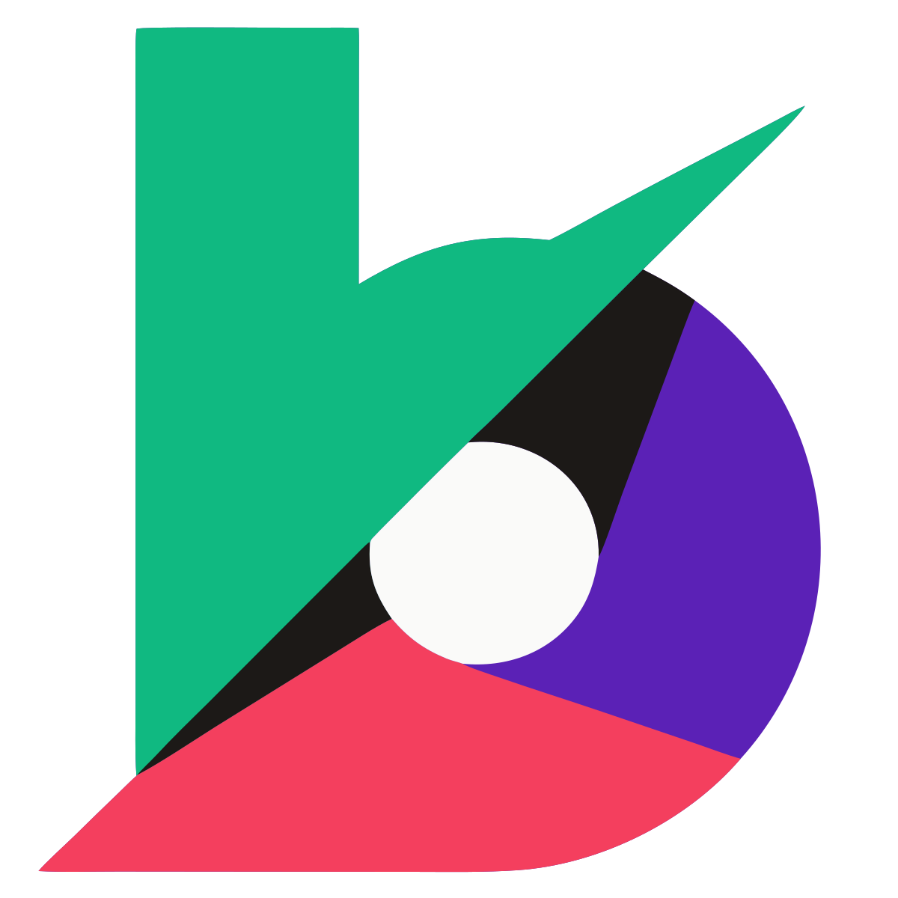
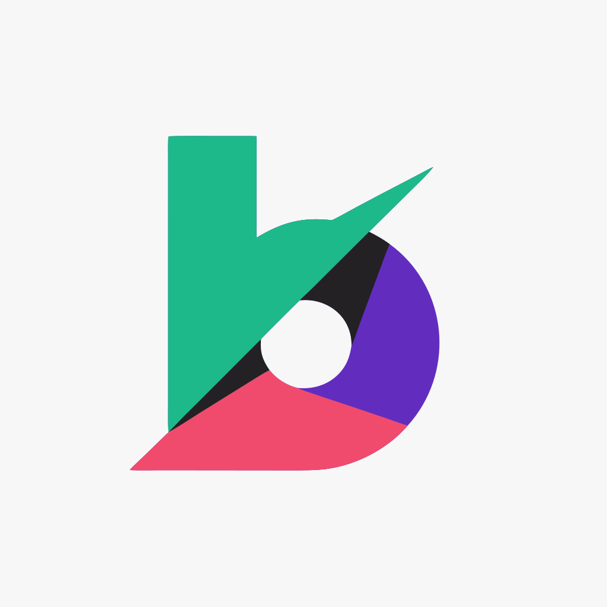
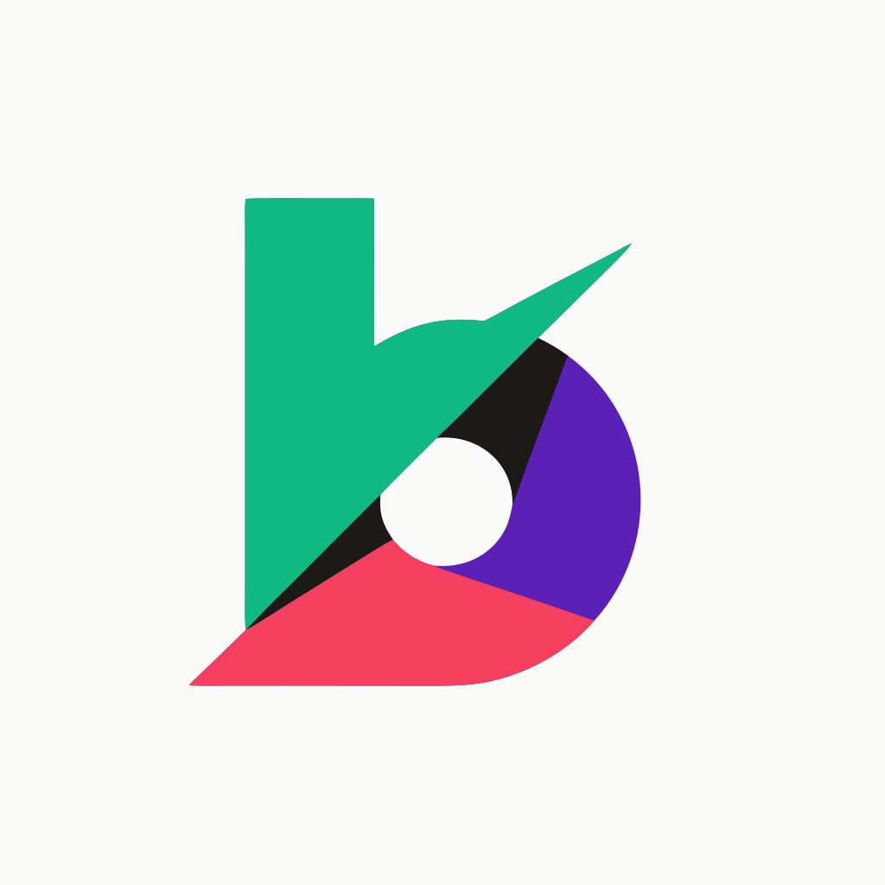

<p align="center">
  <a href="https://brandkit.run">
    
  </a>
</p>

<h1 align="center">brandkit</h1>

<p align="center"><strong>One SVG in. Every surface out. Palette-locked.</strong></p>

<p align="center">
  <a href="https://www.npmjs.com/package/@gent8/brandkit"></a>
  <a href="LICENSE"></a>
  
  
</p>

<p align="center">
  <a href="#install">Install</a> ·
  <a href="#cli-commands">CLI</a> ·
  <a href="#mcp-tools">MCP</a> ·
  <a href="#brandjson">brand.json</a> ·
  <a href="#example-session">Example</a> ·
  <a href="https://brandkit.run">brandkit.run</a>
</p>

**One source SVG → every asset you need to ship a brand.** brandkit is a CLI + MCP server that turns a single SVG into 14 standard files — favicon, apple-touch-icon, maskable PWA icon, og-image, Chrome Web Store assets — all palette-locked to your `brand.json`. The `verify` command is a CI gate: it exits `1` on any off-palette color, so a drift can't sneak into the bundle the same way ESLint catches a typo.

```bash
$ brandkit export dist/logo.svg --brand brand.json --out ./assets
✓ wrote 14 files to ./assets (icon-16.png … cws-marquee-920x680.png)
✓ all colors in palette (5)

$ brandkit verify ./assets/og-image.png  # works on any output
✓ all colors in palette
```

Use `export` to ship the bundle. Use `verify` as a CI gate. Use `recolor` as a pure SVG-in/SVG-out transform. Use `gen` for the full prompt → palette-locked SVG pipeline. Every tool is also exposed over MCP, so any Claude / Anthropic-SDK / MCP-compatible agent can call them inline.

## What's actually different

**1. One command, every surface.** Other dev tools cover one slice (`pwa-asset-generator` does favicons, RealFaviconGenerator does favicons, AI logo SaaS gives you a brand kit but no CI hook). Nothing else gives you the full bundle from one SVG, palette-locked, scriptable:

| Tool | Steps to ship-ready palette-locked SVG + asset bundle | Steps |
|---|---|---|
| DALL-E 3 / Nano Banana 2 / Midjourney v7 | gen raster · vectorize · recolor · verify · render every asset size | 5 |
| Recraft v3 (vector) | gen vector (off-palette) · recolor · verify · render every asset size | 4 |
| Raw Ideogram v3 | gen raster · vectorize · recolor · verify · render every asset size | 5 |
| RealFaviconGenerator / pwa-asset-generator | favicons only · no og-image · no palette enforcement · still need `verify` | 3+ |
| Looka / Brandmark / LogoAI | rich brand kit but SaaS-locked · no CLI · no `verify` | n/a |
| **brandkit** | `brandkit gen` then `brandkit export` (or one MCP call for the gen part) | **1–2** |

`brandkit export` writes 14 files from one source SVG: icons (16/32/48/128), favicon (svg + multi-res ico), apple-touch-icon, android-chrome (192/512), maskable-512, og-image (1200×630), and the three Chrome Web Store assets. All palette-locked, no manual rasterization step.

**2. The bundle is verified, not just generated.** Same source raster, fed through "vectorize only" vs "vectorize + recolor + verify":

<table>
  <tr>
    <td align="center" width="33%"></td>
    <td align="center" width="33%"></td>
    <td align="center" width="33%"></td>
  </tr>
  <tr>
    <td align="center"><sub><b>raw raster</b><br/>source from generator</sub></td>
    <td align="center"><sub><b>vectorize only</b><br/><code>verify</code> ✗ — 48 off-palette</sub></td>
    <td align="center"><sub><b>brandkit</b><br/><code>verify</code> ✓ — 0 off-palette</sub></td>
  </tr>
</table>

| Pipeline | `verify` exit | Off-palette colors |
|---|---|---|
| Vectorize-only (Recraft on the raster) | `1` | **48** |
| **brandkit (vectorize + recolor + verify)** | `0` | **0** ✓ |

The drift is 3–15 RGB points per color — invisible to the eye, but accumulates across favicon, og-image, print, merch, and breaks brand QA downstream. `verify` catches it at build time. Numbers from `brandkit verify` against the [checked-in fixtures](media/comparison/). See [`src/palette.js`](src/palette.js).

## How the pipeline works

1. **Generate** — provider call with palette as a strong hint (Ideogram v3 via fal.ai by default).
2. **Vectorize** — raster → SVG (Recraft API by default).
3. **Recolor** — every `#hex` and `rgb()` in the SVG snapped to the nearest palette member.
4. **Verify** — drop any candidate that still has off-palette colors. Exit `1` on drift.
5. **Trim** — vectorizers pad the mark inside a much larger square; trim rewrites the root viewBox to the rendered geometry bbox so favicons, og-images, and print all fill their canvas.

## Install

### CLI (npm)

```bash
npm install -g @gent8/brandkit
brandkit --help
```

Or run from source:

```bash
git clone https://github.com/gent8/brandkit
cd brandkit
npm install
npm link
brandkit --help
```

### MCP server (Claude Code, Claude Desktop, etc.)

The MCP server lives in `mcp/`. Build the Docker image and add it to your MCP client config:

```bash
docker build -t brandkit-mcp:latest -f mcp/Dockerfile .
```

Claude Code config:

```json
{
  "mcpServers": {
    "brandkit": {
      "command": "docker",
      "args": [
        "run", "-i", "--rm",
        "-e", "FAL_KEY",
        "-e", "RECRAFT_API_KEY",
        "brandkit-mcp:latest"
      ]
    }
  }
}
```

## brand.json

```json
{
  "name": "Acme Co",
  "palette": ["#FAFAF9", "#5B21B6", "#10B981", "#F43F5E", "#1C1917"],
  "paletteTokens": {
    "bg": "#FAFAF9",
    "primary": "#5B21B6",
    "accent": "#10B981",
    "warn": "#F43F5E",
    "ink": "#1C1917"
  },
  "negativePrompt": ["leaves", "plants", "sparkles"]
}
```

The `palette` array is the law. Anything outside it gets snapped to the nearest member.

## CLI commands

| Command | What it does | Side effects |
|---|---|---|
| [`recolor`](#brandkit-recolor-inputsvg---brand-brandjson--o-outsvg) | Snap every color in an SVG to the nearest palette member | SVG-in / SVG-out |
| [`verify`](#brandkit-verify-inputsvg---brand-brandjson) | Exit `1` on any off-palette color — use as CI gate | None (read-only) |
| [`trim`](#brandkit-trim-inputsvg--o-outsvg---pad-pct---strip-bg) | Tighten root viewBox so the mark fills its canvas | SVG-in / SVG-out |
| [`export`](#brandkit-export-inputsvg---brand-brandjson---out-assets---bg-hex) | One SVG → 14 ship-ready assets (icons, favicons, og-image, CWS) | Writes files |
| [`gen`](#brandkit-gen---prompt----brand-brandjson---out-assets---count-4---dry-run) | Full pipeline: prompt → palette-locked SVG candidates | API calls + files |

### `brandkit recolor <input.svg> [--brand brand.json] [-o out.svg]`

Snap every hex in the SVG to the nearest palette color. 3-digit hex auto-expanded. Errors on `hsl()` or named colors with a list of offenders — convert those upstream first. Idempotent.

### `brandkit verify <input.svg> [--brand brand.json]`

Exit `0` if every color is in the palette, `1` with a list of offenders otherwise. Use as a precommit / CI gate.

### `brandkit trim <input.svg> [-o out.svg] [--pad <pct>] [--strip-bg]`

Tighten the root viewBox to the rendered geometry bbox so the mark fills its canvas at every output size. Rewrites `preserveAspectRatio` to `xMidYMid meet` and drops fixed `width`/`height` so consumers can size via container. Pure SVG-in / SVG-out, idempotent. `--strip-bg` also removes shapes that fill the entire viewBox (typically vectorizer-added background rects).

Why this exists: vectorizers (Recraft, vectorizer.ai) emit marks padded inside a much larger square — easily 40–60% empty. Run on a vectorize output before `brandkit export` and every favicon, og-image, and print render fills its canvas instead of inheriting the padding. Wired into `brandkit gen` automatically; standalone for SVGs that came from elsewhere.

### `brandkit export <input.svg> [--brand brand.json] [--out ./assets] [--bg <hex>]`

From one source SVG, produces:

- `icon-{16,32,48,128}.png` — Chrome extension
- `favicon.svg`, `favicon.ico` (multi-res 16+32+48), `apple-touch-icon.png` (180×180)
- `android-chrome-{192,512}.png`, `maskable-512.png`
- `og-image.png` (1200×630, mark centered on `palette[0]` or `--bg`)
- `cws-icon-128.png`, `cws-tile-440x280.png`, `cws-marquee-920x680.png`

Rasterization via [`@resvg/resvg-js`](https://github.com/yisibl/resvg-js). ICO via [`png-to-ico`](https://github.com/steambap/png-to-ico).

### `brandkit gen --prompt "..." [--brand brand.json] [--out ./assets] [--count 4] [--dry-run]`

Full pipeline:

1. Provider call (fal.ai Ideogram v3) with prompt + locked palette + negative-prompt list.
2. Download N rasters → `./assets/_raw/`.
3. Vectorize each (Recraft) → `./assets/_svg/`.
4. Recolor each to snap to palette.
5. Verify each; drop any that still fail.
6. Write `candidates.html` gallery for human selection.
7. After picking, run `brandkit export <chosen.svg>`.

`--dry-run` prints the requests it would make without sending them.

## Providers

Wired:

| Var | Used by |
|---|---|
| `FAL_KEY` | `gen --provider fal` (default) |
| `RECRAFT_API_KEY` | `gen --vectorize recraft` (default) |

Stubbed (`throw new Error("not implemented")`) — PRs welcome:

- `--provider replicate` — needs `REPLICATE_API_TOKEN`
- `--vectorize vectorizer` — needs `VECTORIZER_AI_API_ID` / `VECTORIZER_AI_API_SECRET`

If a key is missing for the chosen provider, brandkit exits 1 with a clear `set $VAR` message.

## MCP tools

When run as an MCP server, three tools are exposed:

- **`brandkit_gen(prompt, palette, count?, extraNegative?, dryRun?)`** — full pipeline in one call. Returns survivor SVGs inline as text. No filesystem handoff needed.
- **`brandkit_recolor(svg, palette)`** — pure text-in/text-out. Snaps every hex AND `rgb()`/`rgba()` color to the nearest palette member.
- **`brandkit_verify(svg, palette)`** — pure text-in/JSON-out gate; reports off-palette offenders with normalized hex + suggestion.
- **`brandkit_trim(svg, padPct?, stripBackground?, keepDimensions?)`** — pure text-in/text-out. Rewrites the root viewBox to the rendered geometry bbox so the mark fills its canvas. Set `stripBackground=true` to drop vectorizer-added canvas-fill rects.

`recolor`/`verify` accept both `#hex` and `rgb()` color forms (Recraft's vectorize output uses `rgb()`). Named CSS colors and `hsl()` are still rejected.

`export` is intentionally CLI-only — it writes 14+ files to disk, which doesn't fit the MCP text-in/text-out model.

## Example session

```bash
cp example/brand.json ./brand.json
$EDITOR brand.json   # set name + palette

brandkit gen --prompt "minimalist wordmark for a moving-storage app, geometric, clean" --count 6
open ./assets/candidates.html
# pick candidate-3.svg

brandkit export ./assets/_svg/candidate-3.svg --out ./assets/final
ls ./assets/final
# → icon-16.png ... cws-marquee-920x680.png
```

## CI gate

```bash
brandkit verify dist/logo.svg --brand brand.json   # exit 1 on drift
```

## Status

> [!NOTE]
> Solo-maintained, best-effort. See [STATUS.md](STATUS.md). Issues may sit; PRs are read on a slow cadence.

## Comparison

See [brandkit.run](https://brandkit.run) for a side-by-side: same prompt, same palette, fed through Claude-direct SVG / raw Ideogram / brandkit. Spoiler: only the brandkit column passes `verify`.

## License

[Apache-2.0](LICENSE). Use it commercially, embed it, fork it — the only ask is that you keep the copyright notice and the license file.
